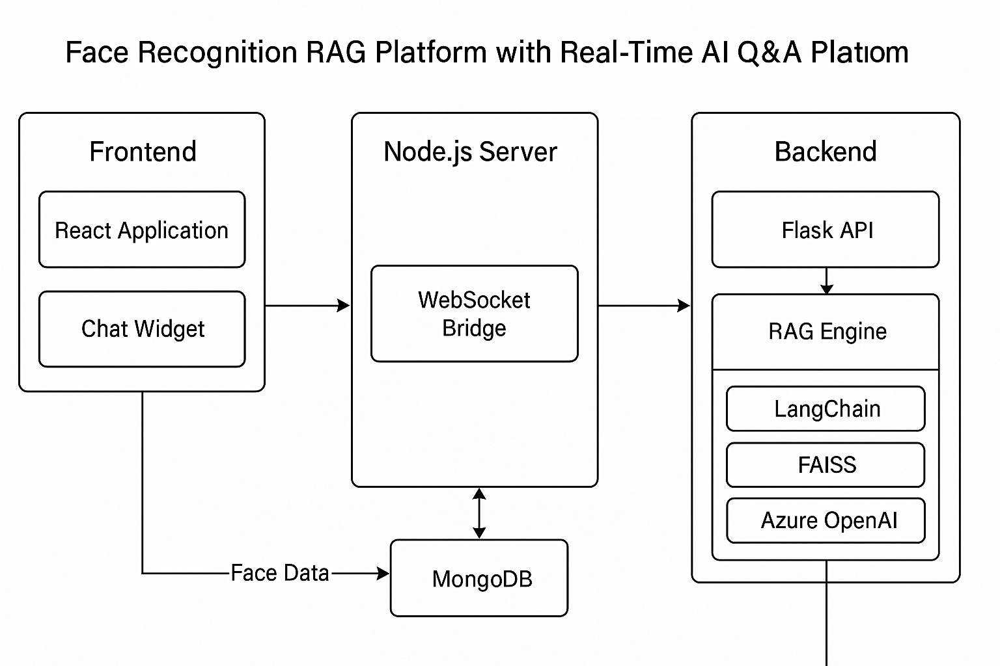

# 🧠 Face Recognition Platform with Real-Time AI Q&A using RAG and OpenRouter.ai

This full-stack project integrates **face recognition**, **RAG-based Q&A (LangChain + FAISS + OpenRouter.ai)**, and **real-time chat** using **Flask**, **React.js**, **Node.js**, and **MongoDB**.  ----

---

## 🌐 Live Features

- 🧑‍💻 Register and recognize faces from webcam
- 🤖 Real-time question answering via LangChain + FAISS + OpenRouter.ai
- 🧠 Uses RAG (Retrieval-Augmented Generation)
- 🔒 MongoDB for persistent face embedding storage
- 🔌 WebSocket server for real-time chat between user and AI

---

🛠️ Tech Stack

| Layer     | Tools                                     |
| --------- | ----------------------------------------- |
| Frontend  | React.js, HTML, CSS, JavaScript           |
| Backend   | Flask (Python)                            |
| AI Engine | LangChain + FAISS + OpenRouter.ai (GPT)   |
| Database  | MongoDB Atlas                             |
| Realtime  | Node.js WebSocket                         |
| DevOps    | GitHub, GitHub Student Pack (API credits) |

💡 RAG Engine

📌 Embeds documents using OpenAIEmbeddings or compatible interface

📁 Stores vectors in FAISS

🧠 Uses LangChain RetrievalQA for question answering

🛰️ Powered by OpenRouter.ai GPT models (like GPT-4, Claude, etc.)

🧠 How It Works
    -📸 Face captured via webcam

    -🔐 Face embeddings stored/retrieved from MongoDB

    -❓ User asks a question

    -🔍 RAG retrieves documents using FAISS

    -🧠 Azure OpenAI generates response

    -💬 Real-time WebSocket sends back answer

API used from:

👉 https://openrouter.ai

## 🖼️ System Architecture

---
